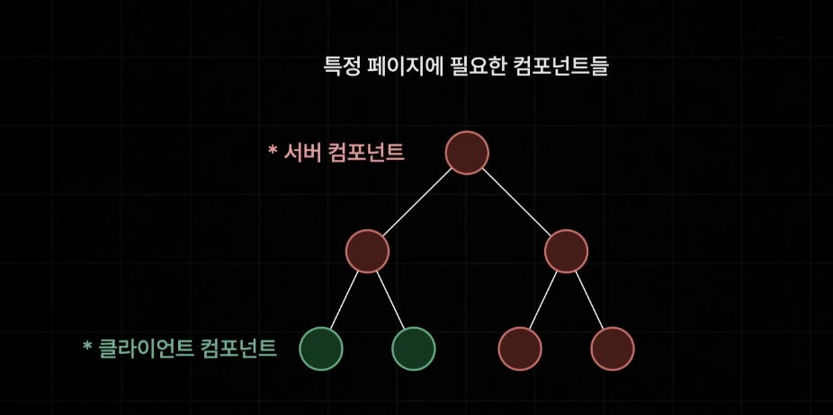

# 센션 1

## 사전 렌더링

브라우저의 요청에 사전에 렌더링이 완료된 html을 응답하는 렌더링 방식
-> 기존의 client side rendering의 단점을 효율적으로 해결

## client side rendering (CSR)

react.js 앱의 기본적인 렌더링 방식
-> 클라이언트에서 직접 화면을 렌더링 하는 방식

- 페이지 이동이 매우 빠르고 쾌적하다는 장점이 있음 (초기)
- 단점 -> 초기접속속도가 느려짐 `FCP (Fisrt Contentful Paint)`
-

### FCP (Fisrt Contentful Paint) -- 최초로 화면이 보이는 순간

- 웹 페이지의 성능을 좌우함.

---

Next.js는 이러헌 CSR의 단점을 해결하기 위한 사전 렌더링 기능

---

html과 js이 상호작용하는 걸 next에서는 수화라고 함.
=> TTI (Time to Interact)

그 이후에 페이지 이동 요청부터는 다시 CSR(클라이언트 사이드 렌더링 방식으로 처리)

---
