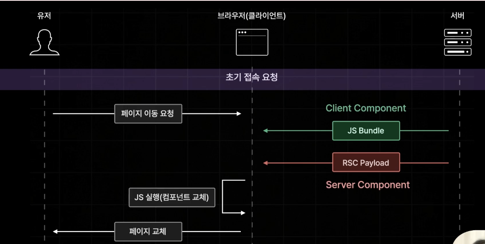

# 섹션 2

## pageRouter

```
<<pages>>
index.js ---- ~/
about.js ---- ~/about
item.js  ---- ~/mypage

```

> pages폴더 안의 파일명 기반으로 자동 페이지 라우팅
>
> 폴더의 이름으로도 가능 ~


### 동적 경로 (Dynamic ROUTES)

~/item/1 같은 동적경로도 가능



---

- search?q=검색어 --> router query
- book/33

  [...id].tsx => catch all seg-
  경로가 book/33 아닌 여러개가 나열돼서 오는 경우
  book/33/22/233/221
  => id에 배열형태로 저장이 됨!

  [[...id]].tsx => optional catch allseg-

  => /book 까지 커버 가능

---

### 프리페칭 (Pre-Fetching)

이동 가능성 있는 모든 페이지를 사전에 미리 불러오는 거 (빠른 이동을 위해)

- Link 태그로 작성한 부분만 가능
- router.prefetch를 이용해서 추가해줄 수도 있음
- Link에서 prefetch 기능을 없앨 수 있음
  ```
  <Link href={"/search"} prefetch = {false}>search</Link>
  ```

---

npm run build

npm run start

---

### API Routes

Next.js에서 API를 구축할 수 있게 해주는 기능


---

### css modlue

---

### Global Layout

---

### 데이터 페칭

#### 01 기존의 react app 에서의 데이터 페칭


=> 초기 접속 요청부터 데이터 로딩까지 오랜 시간이 걸림

#### 02 next app 에서의 데이터 페칭

=> 사전 렌더링


---> 만약 요청이 오래걸리면 ?

그런 요청들은 next가 build 타임에 미리 사전렌더링을 마춰두도록 설정함...


---

### NEXT.JS 사전 렌더링

- SSR (서버사이드 렌더링)
  - 가장 기본적인 사전 렌더링 방식
  - 요청이 들어올 때 마다 사전 렌더링 진행
- SSG (정적 사이트 생성)
  - 빌드 타임에 미리 페이지를 사전렌더링 해 둠
- ISR (증분 정적 재생성)
  - 향후에 다룰 사전 렌더링 방식

---
