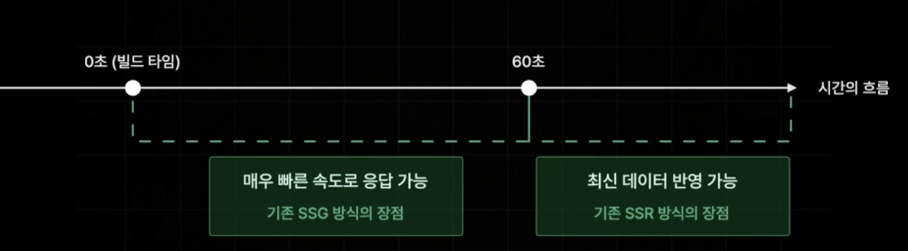

# 섹션 2

## pageRouter

```
<<pages>>
index.js ---- ~/
about.js ---- ~/about
item.js  ---- ~/mypage

```

> pages폴더 안의 파일명 기반으로 자동 페이지 라우팅
>
> 폴더의 이름으로도 가능 ~


### 동적 경로 (Dynamic ROUTES)

~/item/1 같은 동적경로도 가능


---

- search?q=검색어 --> router query
- book/33

  [...id].tsx => catch all seg-
  경로가 book/33 아닌 여러개가 나열돼서 오는 경우
  book/33/22/233/221
  => id에 배열형태로 저장이 됨!

  [[...id]].tsx => optional catch allseg-

  => /book 까지 커버 가능

---

### 프리페칭 (Pre-Fetching)

이동 가능성 있는 모든 페이지를 사전에 미리 불러오는 거 (빠른 이동을 위해)

- Link 태그로 작성한 부분만 가능
- router.prefetch를 이용해서 추가해줄 수도 있음
- Link에서 prefetch 기능을 없앨 수 있음
  ```
  <Link href={"/search"} prefetch = {false}>search</Link>
  ```

---

npm run build

npm run start

---

### API Routes

Next.js에서 API를 구축할 수 있게 해주는 기능


---

### css modlue

---

### Global Layout

---

### 데이터 페칭

#### 01 기존의 react app 에서의 데이터 페칭


=> 초기 접속 요청부터 데이터 로딩까지 오랜 시간이 걸림

#### 02 next app 에서의 데이터 페칭

=> 사전 렌더링


---> 만약 요청이 오래걸리면 ?

그런 요청들은 next가 build 타임에 미리 사전렌더링을 마춰두도록 설정함...


---

### NEXT.JS 사전 렌더링

- SSR (서버사이드 렌더링)
  - 가장 기본적인 사전 렌더링 방식
  - 요청이 들어올 때 마다 사전 렌더링 진행
- SSG (정적 사이트 생성)
  - 빌드 타임에 미리 페이지를 사전렌더링 해 둠
- ISR (증분 정적 재생성)
  - 향후에 다룰 사전 렌더링 방식

---

## SSR (서버 사이드 렌더링)

- 가장 기본적인 사전 렌더링 방식
- 요청이 들어올 때 마다 사전 렌더링 진행

```
export const getServerSideProps = () => {

  // 컴포넌트보다 먼저 실행되어서, 컴포넌트에 필요한 데이터 불러오는 함수

  const data = "hello";

  return {
    props: {
      data,
    },
  };
};
```

=> 객체 형태로 return

---

#### window, document 같은 브라우저 전역을 서버에서 접근하면 에러가 날 수 있음

- console.log(window), window.location 등
- Next.js는 먼저 서버에서 렌더(SSR/프리렌더) 후에 클라이언트에서 하이드레이션한다.

  그래서 서버 단계에선 브라우저 API가 없다 → 접근 시 ReferenceError/크래시 가능.

  => 해결: 클라이언트에서만 실행되게 보장

  - useEffect 안에서 실행(마운트 이후, 브라우저에서만 동작)

---

#### SSR props 타입을 어떻게 줘야할지 ?

`InferGetServerSidePropsType<typeof getServerSideProps>`

InferGetServerSidePropsType => 자동으로 추론해줌


---

### promise.all 병렬 실행

#### 01 기존 방식

```
const allBooks = await fetchBooks();
const recoBooks = await fetchRandomBooks();

```

=> fetchBooks()가 끝날 때까지 기다린 뒤 → fetchRandomBooks() 실행

실행 순서 보장은 되지만, 두 함수가 서로 의존하지 않는 경우에는 불필요하게 느려짐

#### 02 Promise.all 병렬 실행

```
const [allBooks, recoBooks] = await Promise.all([
  fetchBooks(),
  fetchRandomBooks(),
]);
```

=> 두 함수를 동시에 실행 → 서로 의존하지 않는 비동기 작업이면 병렬 처리로 시간 절약 가능

---

## SSG (정적 사이트 생성)


SSR의 데이터 요청이 늦어질 경우의 단점을 해결하기 위해 존재하는 두번째 사전 렌더링 방식

- 빌드타임에 미리 사전 렌더링

- **단점..?** 매번 똑같은 페이지만 응답해서, 최신 데이터 반영이 어려움
  - 정적인 페이지들에 적합한 방식

---

### SSG - 정적 경로에 적용..?

`getStaticProps`


- 흰 동그라미는 SSG
- 빈 동그라미는 우리가 아직 API 작업을 하지 않은 부분들임..
  - 해당 페이지들도 빌드시에 불러옴 => 기본적으로 SSG방식으로 작동

---

#### search 페이지 ---> query


빌드 타임에 페이지를 가져오는 SSG방식에선 query가 없음..

-> 그럼에도 SSG 방식으로 바꾸고 싶으면 React에서 하던 것처럼 fetching 진행해야함....

```
const router = useRouter();
  const { q } = router.query;

  const [books, setBooks] = useState<BookData[]>([]);

  const fetchSearchResult = async () => {
    const data = await fetchBooks(q as string);
    setBooks(data);
  };

  useEffect(() => {
    if (q) {
      //검색 결과를 불러오는 로직
      fetchSearchResult();
    }
  }, [q]);
```

---

### SSG - 동적 경로


-> `[id].tsx`


-> 어떤 경로들이 있을 수 있는지를 설정해야함.

`getStaticPaths` 설정

```
export const getStaticPaths = () => {
  return {
    paths: [
      { params: { id: "1" } },
      { params: { id: "2" } },
      { params: { id: "3" } },
    ],
    fallback: false, // 대체, 대비책, 보험 느낌...
    // false -> 존재 x -> 404로..
  };
};
```

---

### SSG - fallback options

fallback상태 : 페이지 컴포넌트가 아직 서버로부터 데이터를 전달받지 못한 상태


#### 01 false : 404 NotFound 반환

- 위에서 본 예시
- 경로 설정 외엔 404 반환

#### 02 blocking : 즉시 생성 (SSR처럼)


- 사전에 path로 설정한 1~3페이지는 SSG방식으로,,
- 다른 페이지를 요청하면 SSR처럼 즉시 생성됨

#### 03 true : 즉시 생성 + 페이지만 미리 반환


- blocking으로 할 경우, 만약 생성 대기시간이 길어지는 상황을 해결하기 위한 방식
- props가 없는 페이지를 반환 후, props를 계산해서 따로 반환

  => 데이터 있는 페이지 렌더링

꼭 fallback 상태에서만 안나오게 하고, fallback이 끝난 후를 분리해줘야함

```
  const router = useRouter();
  if (router.isFallback) return "로딩중입니다";
```

---

---

## ISR (Incremental Static Regeneration)

### : 증분 정적 재 생성

=> SSG 방식으로 생성된 정적 페이지를 일정 시간을 주기로 다시 생성하는 기술




```
export const getStaticProps = async () => {
  // 컴포넌트보다 먼저 실행되어서, 컴포넌트에 필요한 데이터 불러오는 함수

  const [allBooks, recoBooks] = await Promise.all([
    fetchBooks(),
    fetchRandomBooks(),
  ]);

  // const allBooks = await fetchBooks();
  // const recoBooks = await fetchRandomBooks();

  return {
    props: { allBooks, recoBooks },
    revalidate: 3,
  };
};
```

=> revalidate 추가

---

#### 시간 기반의 ISR을 적용하기 어려운 페이지들 존재

=> 시간과 관계없이 사용자의 행동에 따라 데이터가 업데이트 되는 페이지

ex. 커뮤니티의 게시글 페이지 -> 수정, 삭제

-> 요청을 받을 때마다 페이지를 다시 생성하는 ISR

---

### ISR 주문형 재 검증 (On-Demand-ISR)

요청을 받을 때마다 페이지를 다시 생성하는 ISR


```
import { NextApiRequest, NextApiResponse } from "next";

export default async function handler(
  req: NextApiRequest,
  res: NextApiResponse
) {
  try {
    await res.revalidate(`/`);
    return res.json({ revalidate: true });
  } catch (err) {
    res.status(500).send("Revalidation Failed");
    console.log(err);
  }
}
```

---

## SEO 설정

- favicon
- thumbnail

`import Head from "next/head";`
