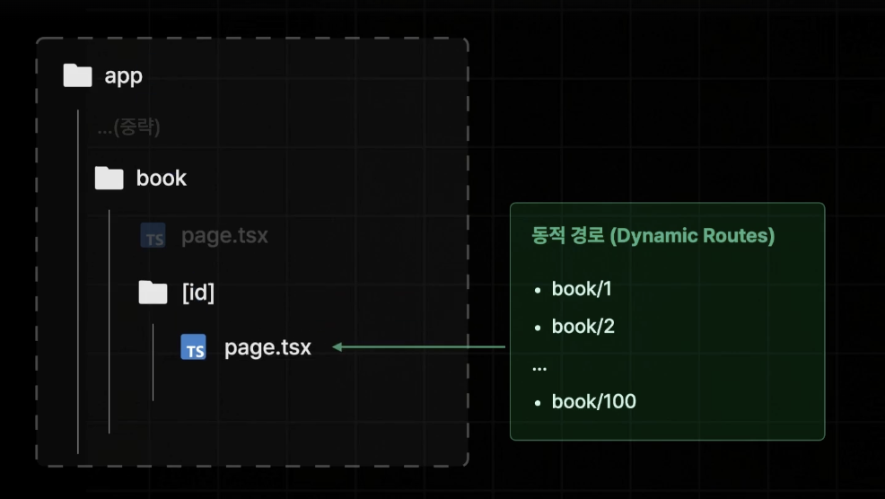
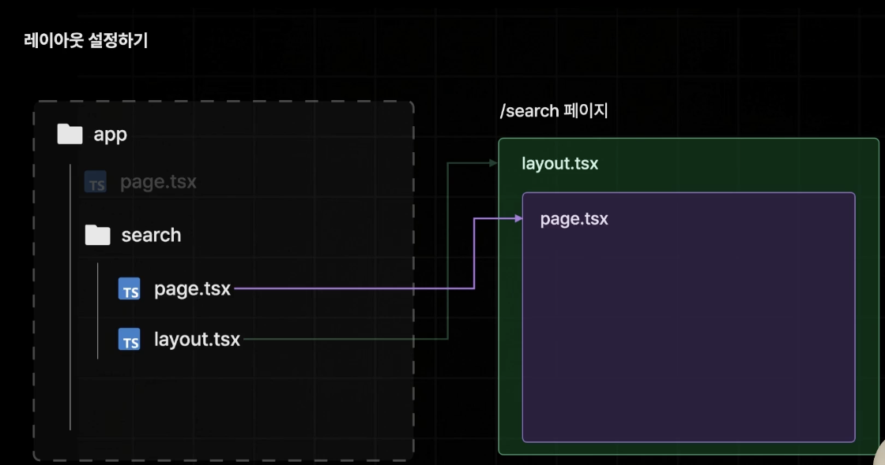
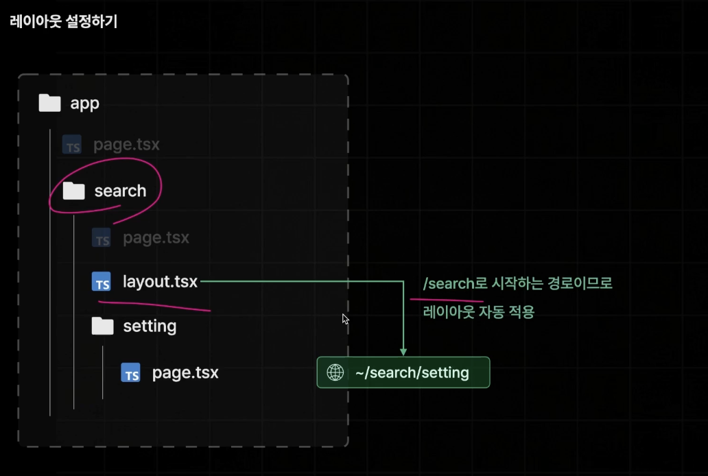
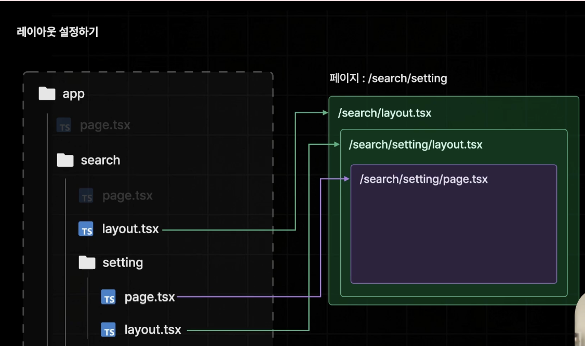
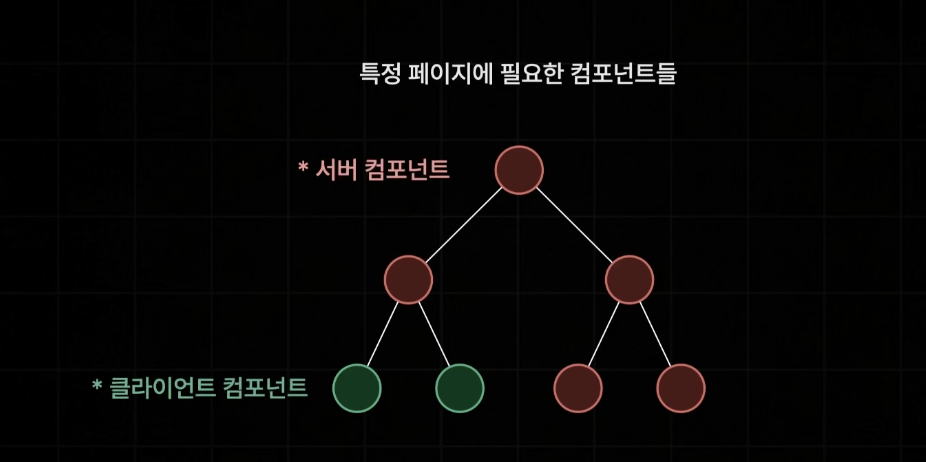
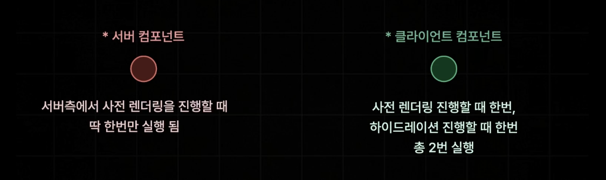
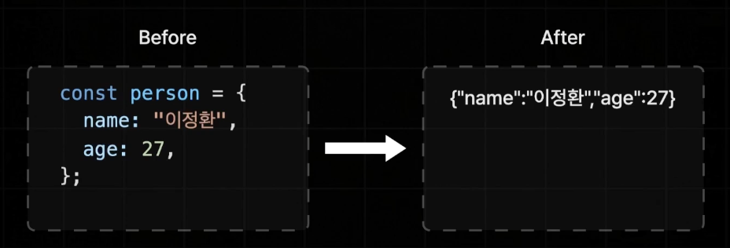
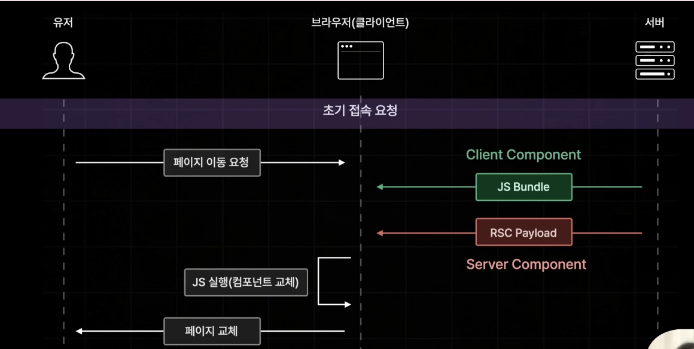
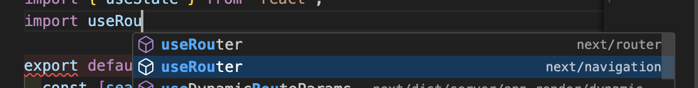

# section 3

## App Router

변경되거나 추가되는 사항

- React 18 신규 기능 추가
- 데이터 페칭 방식 변경
- 레이아웃 설정 방식 변경
- 페이지 라우팅 설정 방식 변경

크게 변경되지 않는 사항

- 네이게이팅 (Navigating)
- 프리페칭 (Pre-Fetching)
- 사전렌더링 (Pre-Rendering)

---

#### 페이지 라우팅

`page.tsx` ~/



app router에서는 query,url parameter 같은 경로상에 포함되는 것들이 Page 컴포넌트에게 props로 전달됨

---

#### 레이아웃

`layout.tsx`







---

#### 다른 페이지끼리 같은 레이아웃 공유

Route Group : 경로 상관없이 레이아웃 공유

- 폴더명을 소괄호로 묶어줌 `(with-searchbar)`

-> 경로에 어떠한 영향도 미치지 않음

---

### 리액트 서버 컴포넌트 : React Server Component

react 18v부터 새롭게 추가된 유형의 컴포넌트

서버측에서만 실행 되는 컴포넌트 (브라우저에서 실행 x)



상호작용이 없는 컴포넌트들은 js bundle에서 한번 더 실행되는 것을 방지



> app router의 컴포넌트들은 default로 서버컴포넌트임

```
"use client";
```

-> 상단에 이렇게 해주면 client component로 쉽게 바뀜

=> searchbar 컴포넌트만 client component로 바꾸면 됨

---

app router에서는 파일 이름이 page나 layout이 아니면 컴포넌트로 사용

---

### 리액트 서버 컴포넌트 주의사항

1. `서버 컴포넌트`에는 브라우저에서 실행될 코드가 포함되면 안됨
2. `클라이언트 컴포넌트`는 클라이언트에서만 실행되지 않음
3. ` 클라이언트 컴포넌트`에서 `서버 컴포넌트`를 import 할 수 없음
4. `서버 컴포넌트`에서 `클라이언트 컴포넌트`에게 직렬화 되지 않는 props는 전달 불가함

=> 서버컴포넌트를 클라이언트컴포넌트에서 import 하면 서버컴포넌트가 클라이언트로 바뀜! import 하지말고 children으로 넘기면 서버컴포넌트로 넘어가니까 그렇게 하자

=> js bundle 양 생각하면 서버 컴포넌트를 최대한으로 유지해야함

---

#### 직렬화 (Serialization)

객체, 배열, 클래스 등의 복잡한 구조의 데이터를 네트워크 상으로 전송하기 위해 아주 단순한 형태(문자열, byte)로 변환하는 것



근데 자바스크립트 함수는 직렬화가 불가능함 !!!

---

### 네비게이팅



app router도 기본적으로 client side render 방식..

하지막 js bundle은 client component만 담고, RSC Payload에 server component 결과를 보냄

---

global navigation bar

---



=> next/router 는 pagerRouter

=> next/navigation은 appRouter

---

#### app router의 프리패칭

프리패칭은 연결된 이동 가능성이 있는 모든페이지의 데이터를 미리 불러와 놓는 기능..

(static) ---> RSC, JS bundle
(dynamic) ---> RSC

---
