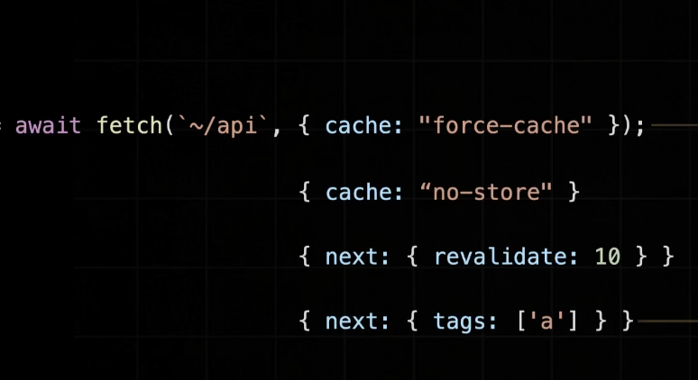

# section 3

## App Router

변경되거나 추가되는 사항

- React 18 신규 기능 추가
- 데이터 페칭 방식 변경
- 레이아웃 설정 방식 변경
- 페이지 라우팅 설정 방식 변경

크게 변경되지 않는 사항

- 네이게이팅 (Navigating)
- 프리페칭 (Pre-Fetching)
- 사전렌더링 (Pre-Rendering)

---

#### 페이지 라우팅

`page.tsx` ~/

app router에서는 query,url parameter 같은 경로상에 포함되는 것들이 Page 컴포넌트에게 props로 전달됨

---

#### 레이아웃

`layout.tsx`

---

#### 다른 페이지끼리 같은 레이아웃 공유

Route Group : 경로 상관없이 레이아웃 공유

- 폴더명을 소괄호로 묶어줌 `(with-searchbar)`

-> 경로에 어떠한 영향도 미치지 않음

---
