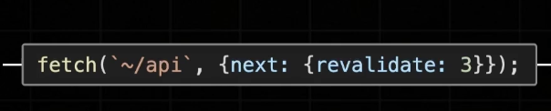

# 섹션 4

## app router의 데이터페칭

---

### 데이터 캐시 (Data Cache)

fetch 메서드를 활용해 불러온 데이터를 Next 서버에서 보관하는 기능

영구적으로 데이터를 보관하거나, 특정 시간을 주기로 갱신 시키는 것도 가능

- cache : "no-store"

  - 데이터 페칭 결과를 저장하지 않는 옵션
  - 캐싱을 아예 하지 않도록 설정하는 옵션

- cache : "force-cache"

  - 요청의 결과를 무조건 캐싱
  - 한번 호출 된 이후에는 호출되지 않음

- cache : revalidate

  - 특정 시간을 주기로 캐시를 업데이트 함
  - page router의 ISR방식과 유사함
    

- next tag
  - on-demand revalidate
  - 요청이 들어왔을 때 데이터를 최신화 함

---

### Request Memoization

fetching을 최적화해주는 기능..

=> 하나의 페이지를 렌더링 하는 동안에만 존재하는 cache...

=> 자동으로 됨

---
